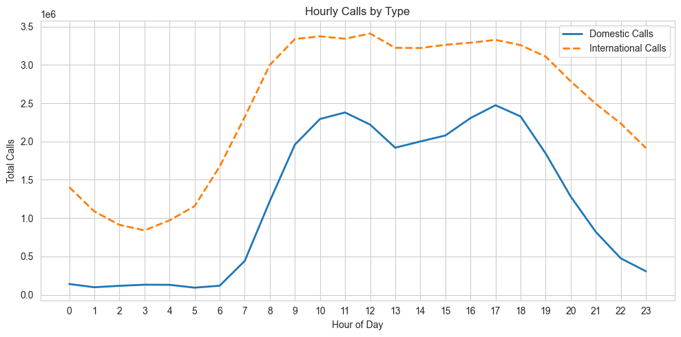
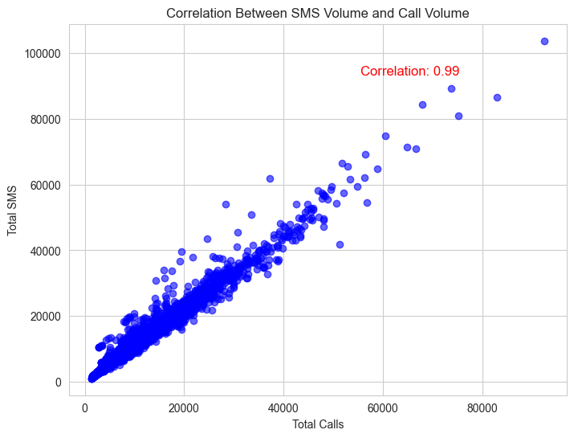

# SMS, Call, and Internet Activity Analysis
##  Introduction

This assignment analyzes SMS, call, and internet activity data collected in Milano over three different days in November 2013. The dataset contains information about communication activity aggregated by spatial grid cells and time intervals.
#### Datasets Used
The data consists of three CSV files:
* sms-call-internet-mi-2013-11-02.csv, sms-call-internet-mi-2013-11-04.csv, and sms-call-internet-mi-2013-11-06.csv

#### Dataset content
Each file contains communication activity information, about:

* received SMS, sent SMS, incoming calls, outgoing calls, and Internet activity  and their metadata. 

## Overview of the Approach

The three datasets were loaded separately and then concatenated into a single dataset since they all shared the same structure. Date and time features were extracted to support time-based analysis. Aggregate columns for total SMS, total calls, and total internet activity were created to simplify analysis.

## Key Decisions Made

After merging the data, the dataset was checked for missing values. Missing values were handled by filling each column with its mean, which is a robust approach that avoids data loss and reduces bias. This ensured the dataset remained complete and suitable for analysis.

From the timestamp column, Hour and Date features were drived to support the analysis of hourly patterns, peak activity times, and differences between daytime and nighttime usage.

## Summary of key findings
 Spatial Coverage

 Dataset contains `10000` unique CellIDs

Number of unique Country Codes

There is `302` unique country codes

##### Temporal Activity Patterns

The Most common peak hour accross all grids is `17:00` while the lowest activities was found to be `4:00`. Hourly activity follows normal daily routines: usage peaks around `17:00` after work hours, while the lowest activity occurs around `4:00`, when most people are inactive.

##### Daytime vs Nighttime Activity
Most of the activity occurs during daytime hours (6am–8pm), accounting for `78.51%` of the total. In contrast, nighttime activity (8pm–6am) represents only `21.49%`.

##### Domestic vs International Activity

Domestic and international calls follow a similar hourly pattern; however, they differ in volume. International calls consistently dominate domestic calls across most hours.

Both call and SMS activity are dominated by international communication. Domestic calls account for `33.11%` of total call volume compared to `66.89%` for international calls, while an even stronger pattern is observed for SMS, with only `24.98%` being domestic and `75.02%` international. Together, these results indicate that cross-border communication consistently outweighs domestic communication across both voice and messaging services.

The incoming-to-outgoing ratio for international calls is `1.67`, which means that more international calls are received than made. This shows that the dataset has more inbound international call activity than outbound.

##### SMS and Call Correlation

The correlation between SMS volume and call volume at the grid level is `0.99`. This indicates a very strong positive relationship between SMS and call activity at grid level. This informs that, when sms volume increases, call valume will tend to increase.
##### Libraries Used

+ Python
+ Pandas
+ NumPy
+ Matplotlib
+ Seaborn
+ Os
+ zipfile
+ tabulate

