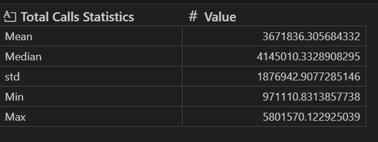

# SMS, Call, and Internet Activity Analysis
## 1. Introduction

This assignment analyzes SMS, call, and internet activity data collected in Milano over three different days in November 2013. The dataset contains information about communication activity aggregated by spatial grid cells and time intervals.

The main purpose of this analysis is to clean and merge multiple datasets, prepare an analysis-ready dataset, and explore patterns in communication activity across time and activity types:   

### Datasets Used

#### The data consists of three CSV files:

* sms-call-internet-mi-2013-11-02.csv

* sms-call-internet-mi-2013-11-04.csv

* sms-call-internet-mi-2013-11-06.csv

#### Dataset content
Each file contains communication activity information, about:

* received SMS
* sent SMS
* incoming calls
* outgoing calls
* Internet activity

The datasets represent activity for different three days but share the same structure, which allows them to be combined into a single dataset for analysis.

## 2. Approach

The analysis was performed in several structured steps:

Load the three datasets separately.

Add date and time related columns to support time-based analysis.

Merge all datasets into one combined dataframe.

Clean the data and handle missing values.

Create aggregate activity columns.

Perform exploratory and statistical analysis to answer all required questions.

Summarize findings and interpret results.

This step-by-step approach ensures that the data is clean, consistent, and suitable for analysis before drawing conclusions.

4. Data Loading and Merging

All three CSV files were loaded using the Pandas library. After loading, a new column was added to each dataset to represent the date associated with the file.

The datasets were then merged using concatenation to create a single dataframe containing all records from the three days. This combined dataset was used for all further analysis.

Total number of records after merging:
__________

5. Feature Engineering
5.1 Time Features

From the timestamp column, the following features were extracted:

Hour of day (0–23)

Date

These features were necessary to analyze hourly patterns, peak activity times, and differences between daytime and nighttime usage.

5.2 Aggregate Activity Columns

The following aggregate columns were created:

total_sms: sum of incoming and outgoing SMS

total_calls: sum of incoming and outgoing calls

total_internet: total internet activity

These columns simplify analysis by allowing total activity comparisons instead of working with multiple raw columns.

6. Handling Missing Values

After merging the datasets, the combined dataframe was checked for missing (NaN) values.

Missing values were found in the dataset.

Each missing value was replaced using the mean of its respective column, as required by the assignment.

This approach ensures that no records are removed while keeping the overall distribution of the data stable.

Columns with the most missing values:
__________

Total number of records modified due to missing values:
__________

## 3. Summary of key findings
 3.1 Spatial Coverage

 Dataset contains `10000` unique CellIDs

3.2 Number of unique Country Codes

There is `302` unique country codes

3.3. Temporal Activity Patterns
 Peak and Lowest Activity Hours

Hourly activity was calculated by summing total activity across all grid cells.

The Most common peak hour accross all grids is `18:00`

Hour with the lowest activity is `4:00` 

Hourly activity follows normal daily routines: usage peaks around `18:00` after work hours, while the lowest activity occurs around `4:00`, when most people are inactive or sleep. These results show how communication activity varies throughout the day.

3.4. Call Statistics by Hour

For total call activity, the following statistics were calculated

3.5. Daytime vs Nighttime Activity

Activity was divided into: Daytime: 6:00 AM – 8:00 PM and Nighttime: 8:00 PM – 6:00 AM. The percentage of total activity occurring during each period was calculated.

Daytime activity percentage:
__________

Nighttime activity percentage:
__________

Interpretation of these results:
__________

10. Domestic vs International Activity
10.1 Call Timing Comparison

Calls were categorized as:

Domestic (Italy, country code 39)

International (all other country codes)

Hourly patterns for domestic and international calls were compared to see if they occur at different times of day.

Key differences observed:
__________

10.2 Call Volume Percentages

Percentage of domestic calls:
__________

Percentage of international calls:
__________

10.3 SMS Volume Percentages

Percentage of domestic SMS:
__________

Percentage of international SMS:
__________

10.4 Incoming vs Outgoing International Calls

The ratio of incoming to outgoing international calls was calculated.

Incoming to outgoing ratio:
__________

Interpretation:
__________

11. Statistical Analysis Using NumPy

NumPy was used to perform statistical comparisons between different conditions, including:

Domestic vs international call volumes

Differences in activity distributions

Statistical method used:
__________

Key results and interpretation:
__________

12. Correlation Analysis

To understand the relationship between SMS and call activity, data was aggregated at the grid (CellID) level.

The correlation between total SMS volume and total call volume was calculated.

Correlation value:
__________

Interpretation of correlation:
__________

13. Tools and Libraries Used

Python

Pandas

NumPy

Matplotlib

Seaborn

14. Repository Information

All code, analysis, and results are hosted on my GitHub account as required.